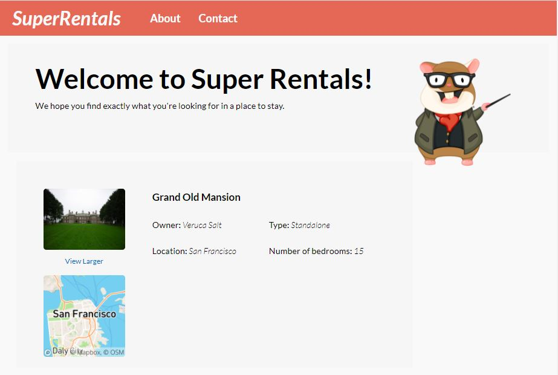

# Ember Super Rentals Project

This Ember project focuses on the development of a website ("Super Rentals") that enables users to browse interesting places to stay during next vacation. 

## Tech Stack
- Ember.js
  - HTML
  - CSS
  - JavaScript

## What I have learnt
- Automated and acceptance testing
- Ember Components 